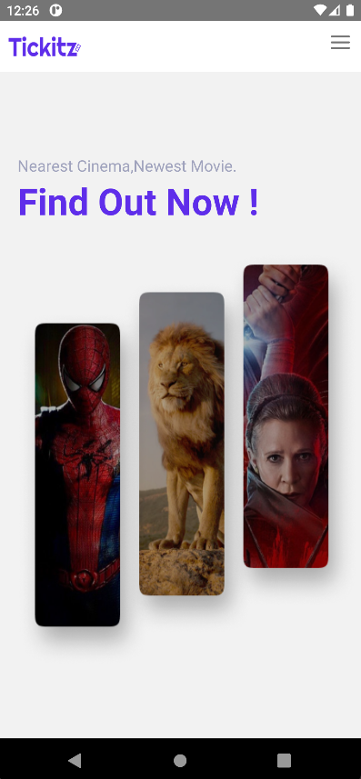
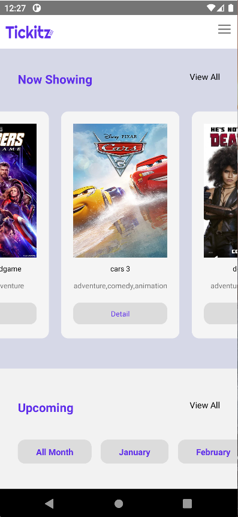
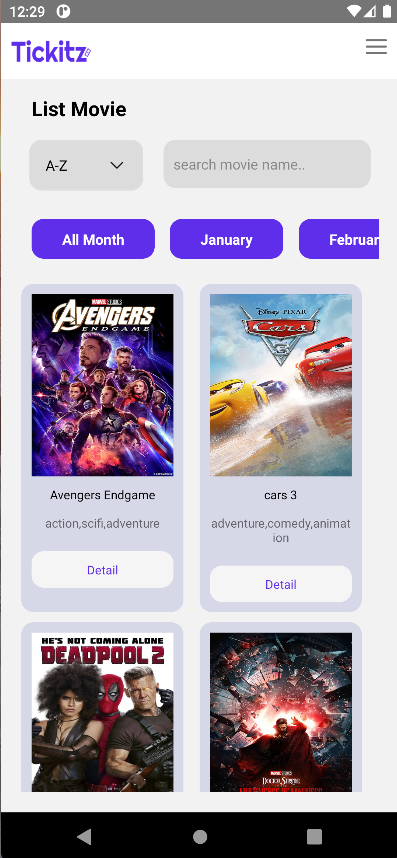
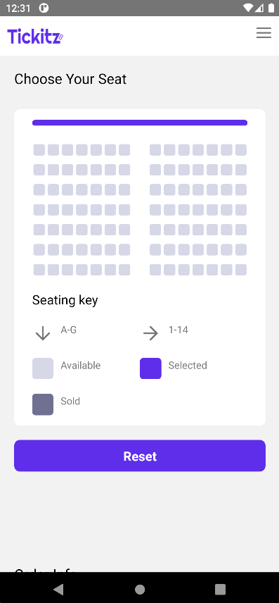
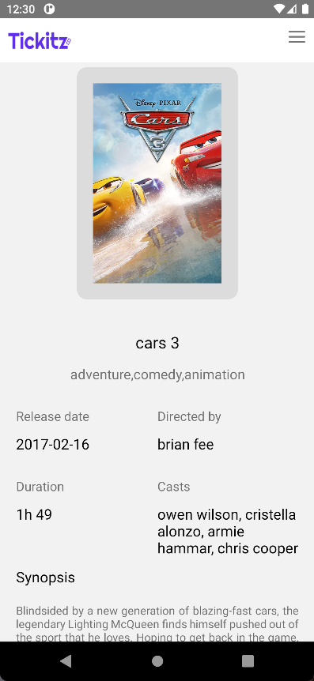
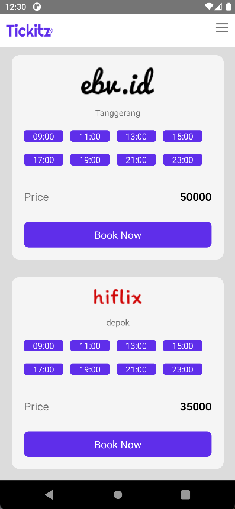

<h1 align='center'>Tickitz Mobile App</h1>
  <p align="center">
    <a href="link_deploy">View Demo</a>
    ·
    <a href="https://github.com/usergithub/namarepo/issues">Report Bug</a>
    ·
    <a href="https://github.com/usergithub/namarepo/pulls">Request Feature</a>
  </p>

<p align="center">
 <a href="https://ibb.co/cc1ThB8"></a>
</p>

## About The Project

Website Application Booking Ticket| Mobile App Frontend Repository

## Built With

[](https://github.com/react-bootstrap/react-bootstrap)
[](https://reactnative.dev/)

## Requirements

1. <a href="https://nodejs.org/en/download/">Node Js</a>
2. Node_modules `npm install` or `yarn install`
3. Backend API Tickitz [`here`](https://github.com/aflahfernanda/paytickz-project)

## Getting Started

1. Download this Project or you can type `git clone https://github.com/aflahfernanda/Tickitz-Mobile-App.git`
2. Open app's directory in CMD or Terminal
3. Type `npm install` or `yarn install`
4. Add .env in nextConfig.js

```sh
URL_BACKEND: "https://project-paytickz.herokuapp.com/",
URL_CLOUDINARY: "https://res.cloudinary.com/da776aoko/image/upload/v1656419307/",
```

5. Type `npm run dev`

## Acknowledgements

- [axios](https://www.npmjs.com/package/axios)
- [bootstrap](https://www.npmjs.com/package/bootstrap)
- [node-sass](https://www.npmjs.com/package/node-sass)
- [qs](https://www.npmjs.com/package/qs)
- [react-redux](https://www.npmjs.com/package/react-redux)
- [redux](https://www.npmjs.com/package/redux)
- [redux-logger](https://www.npmjs.com/package/redux-logger)
- [redux-promise-middleware](https://www.npmjs.com/package/redux-promise-middleware)
- [redux-thunk](https://www.npmjs.com/package/redux-thunk)
- [eslint](https://www.npmjs.com/package/eslint)

## App License

© [Tickitz](https://github.com/aflahfernanda/Tickitz-Mobile-App.git)

## 🔎 Preview Pages

<p float="left">
  
  
  
</p>

<br>

|                    **Home Screen**                    |                              **Home Now Showing Screen**                              |                                     **Order Seat Screen**                                     |                               **List Movie Screen**                               |                                 **Detail Movie Screen**                                 |                                        **Schedule Screen**                                        |
| :---------------------------------------------------: | :-----------------------------------------------------------------------------------: | :-------------------------------------------------------------------------------------------: | :-------------------------------------------------------------------------------: | :-------------------------------------------------------------------------------------: | :-----------------------------------------------------------------------------------------------: |
|  |                           |                                  |                       |                             |                                       |
|                       <p> </p>                        | <a href="https://github.com/tbmanix" target="_blank">`https://github.com/tbmanix`</a> | <a href="https://github.com/donny17-bit" target="_blank">`https://github.com/donny17-bit`</a> | <a href="https://github.com/Qxtlp" target="_blank">`https://github.com/Qxtlp`</a> | <a href="https://github.com/foldadjo" target="_blank">`https://github.com/foldadjo`</a> | <a href="https://github.com/aflahfernanda" target="_blank">`https://github.com/aflahfernanda`</a> |

---

## ✍️ itJobs - Backend Link

https://github.com/aflahfernanda/paytickz-project

<br>

## ⛏️ Built Using

- [axios](https://www.npmjs.com/package/axios)
- [qs](https://www.npmjs.com/package/qs)
- [react-redux](https://www.npmjs.com/package/react-redux)
- [redux](https://www.npmjs.com/package/redux)
- [redux-logger](https://www.npmjs.com/package/redux-logger)
- [redux-promise-middleware](https://www.npmjs.com/package/redux-promise-middleware)
- [redux-thunk](https://www.npmjs.com/package/redux-thunk)
- [eslint](https://www.npmjs.com/package/eslint)

<br>

## Contributors

If you have a suggestion that would make this better, please fork the repo and create a pull request.

1. Fork the Project
2. Create your Feature Branch
3. Commit your Changes
4. Push to the Branch
5. Open a Pull Request

## Contact

Instagram - [@aflahfernanda](https://www.instagram.com/aflahfernanda/)
linkedIn - [@aflahfernanda](https://www.linkedin.com/in/aflah-fernanda-6841401ab/)
email-[fernandaaflah@gmail.com](fernandaaflah@gmail.com)

## License

© [Mohd.Aflah Fernanda](https://github.com/aflahfernanda)
